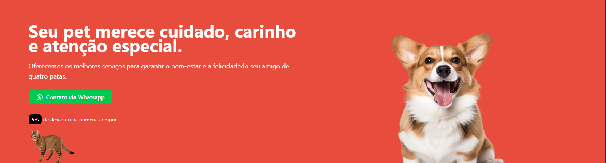
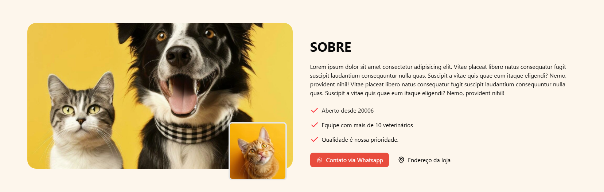
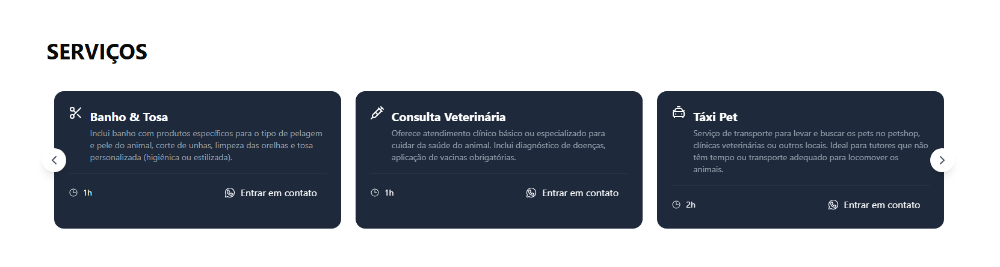
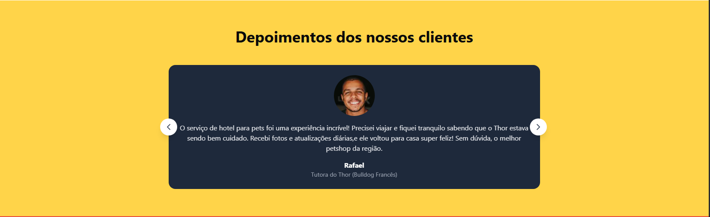
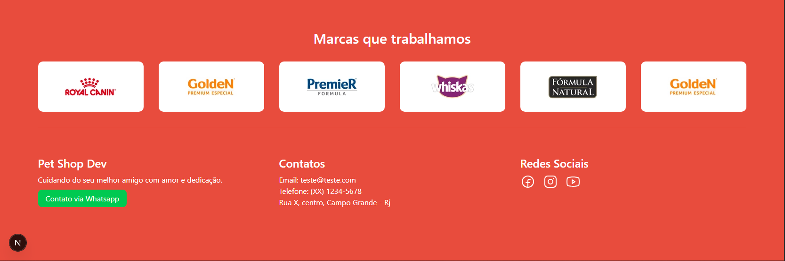
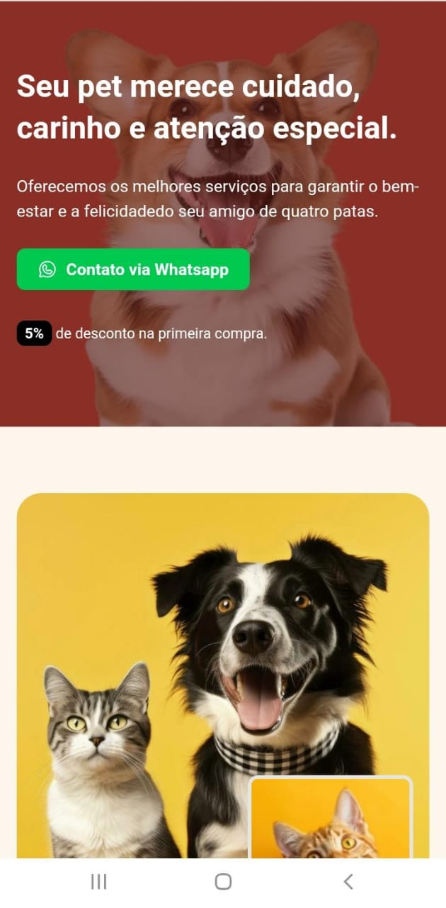
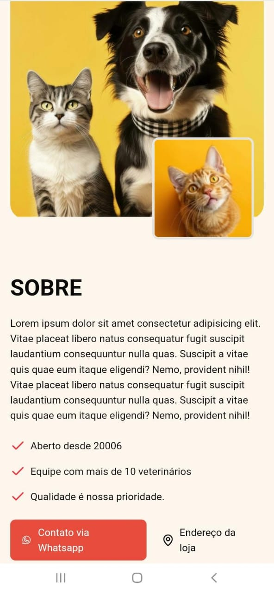
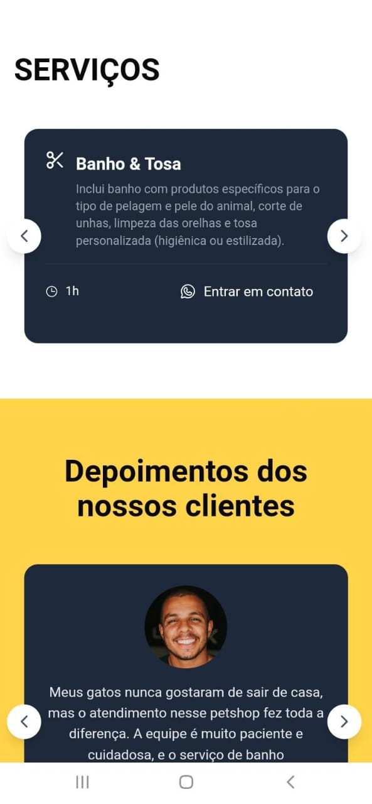
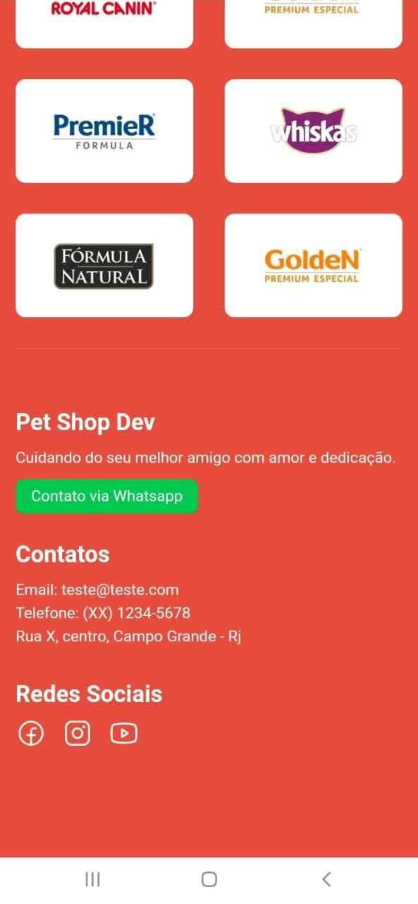

**Landing Page Pet Dev** 🐾

## 🧠 Ideia do projeto

Este projeto foi feito para treinar construção de landing pages com foco em performance, layout responsivo e experiência do usuário para negócios pet.

## 🚀 Tecnologias utilizadas:

- Next.js
- React
- TypeScript
- TailwindCSS

## 💻 Demonstração 

Seção Hero:

_____________________________________________

Seção Sobre:

_____________________________________________

Seção Serviços:

_____________________________________________

Seção Depoimentos:

_____________________________________________

Seção Contato:

_____________________________________________

## 📱 Mobile

<h4>Hero</h4>

<h4>Sobre</h4>

<h4>Serviços</h4>

<h4>Depoimentos</h4>

<h4>Contato</h4>

Acesse o site aqui: [petdev.vercel.app](https://landing-page-pet-dev.vercel.app/)

## 📬 Contato

Entre em contato: jeffersoncardoso.dev@gmail.com

